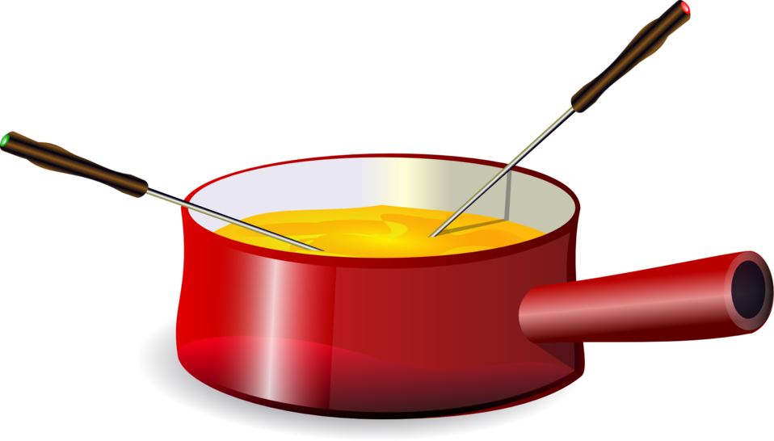

# fondq

The code herein is a prototypical *full-stack compiler* from a high level
algorithm to a NISQ device. For the purpose of this example, the algorithm
is Grover's algorithm scripted in `grover_algorithm.py`.

The NISQ type device is expected to support the following:
* Acts on a square sized lattice
* Supports only Hadamard, CNOT, Rz, and measurement gates
* The device should support the decomposition of unsupported gates

Because the example is around a simple instance of Grover's algorithm, the
herein scripted device supports the decomposition of Toffoli, CZ, and X gates.

## Installation
* Clone the repository locally on your computer
* Install Cirq in a virtual environment: `bash construct_cirq_environment.sh`
* Activate the venv: `source .venv/bin/activate`
* Run the compilation and optimisation: `python3 fondq_stack_main.py`

## Compile and optimize

The compilation for the `FondqDevice` takes place when the `cirq.Circuit` is 
constructed with the `device` parameter. Removing that parameter results in the 
undecomposed version of Grover.

After Toffoli decomposition, there are many gate-level optimisations which could
be performed. In this version, two optimisations are implemented in `cnotopt.py`:
a) removing Hadamard gates which appear in a sequence (`H*H=I`); b) reversing
the direction of CNOTs surrounded by Hadamards. The optimizers are implemented
 for pedagogical reasons, and the results are not the best one could achieve.

**2020. The fondq project is improved at the
 [Google Cirq Tutorials](https://sites.google.com/view/cirq-for-nisq/)**

**2019.** The fondq project resulted from the
 [Google Cirq Bootcamps](https://sites.google.com/view/cirq-bootcamps/)